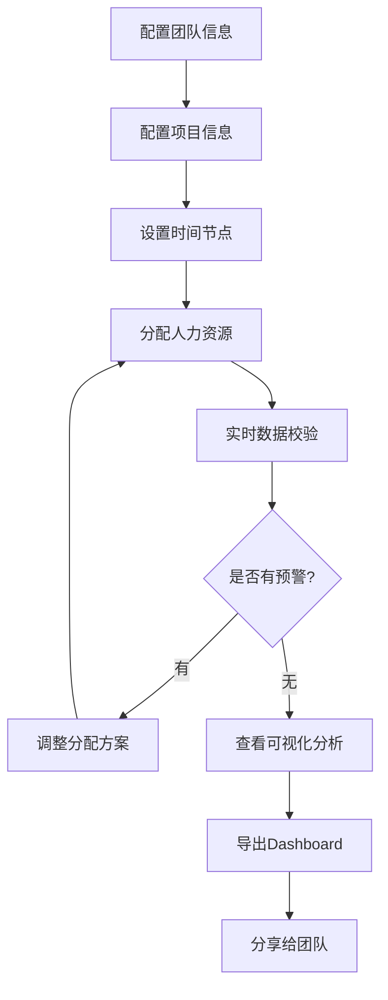

# Omada 研发人力排布可视化工具 - 快速启动指南

## 🚀 快速开始

欢迎使用 **Omada 研发人力排布可视化工具**！本指南将帮助您在5分钟内快速上手这个强大的人力资源管理平台。

## 📋 系统要求

### 环境要求
- **Node.js**: >= 18.0.0
- **npm**: >= 8.0.0 或 **yarn**: >= 1.22.0
- **浏览器**: Chrome 90+, Firefox 88+, Safari 14+, Edge 90+

### 硬件要求
- **内存**: 至少 4GB RAM
- **存储**: 至少 500MB 可用空间
- **网络**: 稳定的互联网连接（用于依赖下载）

## ⚡ 快速安装

### 1. 克隆项目
```bash
# 克隆项目到本地
git clone <repository-url>
cd rd-manpower-tool
```

### 2. 安装依赖
```bash
# 使用 npm
npm install

# 或使用 yarn
yarn install
```

### 3. 启动开发服务器
```bash
# 使用 npm
npm run dev

# 或使用 yarn
yarn dev
```

### 4. 访问应用
打开浏览器访问 `http://localhost:5173`

🎉 **恭喜！** 您已成功启动应用！

## 🎯 功能概览

### 主要功能模块

```
┌─────────────────────────────────────────────────────────────┐
│                    Omada 人力排布工具                        │
├─────────────────────────────────────────────────────────────┤
│  📊 基础配置  │  👥 人力排布  │  📈 人力可视化  │  📤 导出   │
│  ─────────────│  ─────────────│  ─────────────│  ─────────  │
│  • 团队管理   │  • 分配表格   │  • 桑基图     │  • HTML    │
│  • 项目管理   │  • 实时校验   │  • 分布图     │  • 报告    │
│  • 时间管理   │  • 预警系统   │  • 交互分析   │  • 分享    │
└─────────────────────────────────────────────────────────────┘
```

## 📚 详细使用指南

### 第一步：基础配置

#### 1.1 团队配置
1. 点击 **"基础配置"** 标签
2. 在 **团队配置** 区域：
   - 添加团队名称（如：前端团队、后端团队、测试团队）
   - 设置团队容量（如：10人）
   - 添加团队描述
   - 选择团队颜色标识

```typescript
// 示例团队配置
{
  name: "前端团队",
  capacity: 12,
  description: "负责Web前端开发",
  color: "#3B82F6"
}
```

#### 1.2 项目配置
1. 在 **项目配置** 区域：
   - 添加项目名称（如：controller 6.0、omada 5.7）
   - 设置项目状态（开发中/已发布/计划中）
   - 添加项目描述
   - 选择项目颜色

```typescript
// 示例项目配置
{
  name: "controller 6.0",
  status: "development",
  description: "控制器主要版本升级",
  color: "#1E40AF"
}
```

#### 1.3 时间点配置
1. 在 **时间配置** 区域：
   - 添加关键时间节点（如：7月、9月、11月）
   - 设置时间日期
   - 选择时间点类型
   - 添加描述信息

### 第二步：人力排布

#### 2.1 使用分配表格
1. 点击 **"人力排布"** 标签
2. 您将看到一个多维度的分配表格：
   - **行**: 项目列表
   - **列**: 时间点 × 团队
   - **单元格**: 人力分配数值

#### 2.2 表格操作技巧
- **冻结视图**: 表头和第一列自动冻结，方便浏览大量数据
- **显示控制**: 点击右上角 ⋮ 图标，可开关团队细节显示
- **数字输入**: 直接点击单元格输入数字，支持小数
- **实时校验**: 输入后立即显示利用率和预警信息

#### 2.3 预警系统
- 🟢 **绿色**: 正常状态（<100%）
- 🟡 **黄色**: 满配状态（100-110%）
- 🔴 **红色**: 超配状态（>110%）

### 第三步：人力可视化

#### 3.1 桑基图分析
1. 点击 **"人力可视化"** 标签
2. 查看 **人力流动桑基图**：
   - **4列布局**: 团队 → 各时间点项目
   - **智能算法**: 自动计算人力继承和转移
   - **连接线合并**: 相同流向自动合并，显示详细构成
   - **交互功能**: 
     - 鼠标悬停查看详情
     - 点击图例筛选团队/项目
     - 节点显示详细人员分布

#### 3.2 分布图分析
1. 查看 **人力分布图**：
   - **左侧饼图**: 显示当前时间点的项目分布
   - **右侧折线图**: 显示各项目的人力趋势
   - **联动交互**: 鼠标悬停折线图，饼图自动更新

### 第四步：数据导出

#### 4.1 HTML Dashboard导出
1. 点击右上角的 **"导出Dashboard"** 按钮
2. 系统将生成完整的HTML文件，包含：
   - 所有图表和交互功能
   - 完整的数据和算法
   - 离线可用的报告
   - 导出时间和配置信息

#### 4.2 分享和使用
- 生成的HTML文件可以直接分享给团队成员
- 支持离线查看，无需网络连接
- 保持与应用完全一致的交互体验

## 🎨 界面介绍

### 主界面布局

```
┌─────────────────────────────────────────────────────────────┐
│  🏠 Omada Logo              [导出Dashboard] [设置] [帮助]    │
├─────────────────────────────────────────────────────────────┤
│  📊基础配置  👥人力排布  📈人力可视化                        │
├─────────────────────────────────────────────────────────────┤
│                                                             │
│                     主要内容区域                             │
│                                                             │
│                                                             │
└─────────────────────────────────────────────────────────────┘
```

### 关键交互元素

1. **标签导航**: 顶部标签切换不同功能模块
2. **工具栏**: 右上角提供导出、设置等功能
3. **筛选控件**: 图表区域的筛选和显示控制
4. **状态指示**: 颜色编码的状态和预警信息

## 🔧 高级功能

### 数据持久化
- **自动保存**: 所有配置和分配数据自动保存到本地
- **数据恢复**: 刷新页面后数据自动恢复
- **清理数据**: 可通过设置清理本地数据

### 键盘快捷键
- `Tab`: 在表格单元格间快速切换
- `Enter`: 确认输入并移动到下一行
- `Esc`: 取消当前编辑
- `Ctrl/Cmd + S`: 手动保存数据

### 响应式设计
- **桌面端**: 完整功能体验
- **平板端**: 优化的触摸交互
- **手机端**: 简化的查看模式

## 🚨 常见问题解决

### Q1: 页面加载缓慢
**解决方案**:
- 检查网络连接
- 清理浏览器缓存
- 使用现代浏览器（Chrome/Firefox/Safari最新版）

### Q2: 数据输入不生效
**解决方案**:
- 确保输入的是有效数字
- 检查是否有错误提示
- 尝试刷新页面

### Q3: 图表显示异常
**解决方案**:
- 检查是否有配置数据
- 确保团队和项目配置完整
- 尝试重新分配人力数据

### Q4: 导出功能失败
**解决方案**:
- 检查浏览器是否允许文件下载
- 确保有足够的存储空间
- 尝试使用不同浏览器

## 💡 最佳实践

### 配置建议
1. **团队设置**: 建议按技能领域划分团队（前端、后端、测试、产品等）
2. **项目管理**: 使用清晰的项目命名规范，包含版本号
3. **时间规划**: 选择关键里程碑作为时间节点
4. **颜色选择**: 使用对比度高的颜色，便于区分

### 使用技巧
1. **分步配置**: 先完成基础配置，再进行人力分配
2. **实时校验**: 利用颜色预警及时发现配置问题
3. **定期导出**: 重要配置完成后及时导出备份
4. **团队协作**: 定期分享Dashboard给团队成员

### 性能优化
1. **数据量控制**: 建议单次配置不超过20个项目
2. **浏览器选择**: 推荐使用Chrome或Firefox
3. **内存管理**: 长时间使用后建议刷新页面

## 🔄 数据流程

### 典型工作流程



## 📊 示例数据

### 快速体验数据
如果您想快速体验功能，可以使用以下示例配置：

#### 团队配置示例
```
前端团队: 12人, 蓝色 #3B82F6
后端团队: 15人, 红色 #EF4444
测试团队: 8人, 绿色 #10B981
产品团队: 5人, 黄色 #F59E0B
```

#### 项目配置示例
```
controller 6.0: 开发中, 深蓝色 #1E40AF
omada 5.7: 已发布, 深红色 #DC2626
gateway 3.2: 计划中, 深绿色 #059669
```

#### 时间节点示例
```
7月版本: 2024-07-01
9月版本: 2024-09-01
11月版本: 2024-11-01
```

## 🎓 学习资源

### 视频教程
- 5分钟快速上手指南
- 高级功能详解
- 最佳实践案例

### 文档资源
- [架构设计文档](./架构设计文档.md)
- [API参考文档](./API文档.md)
- [故障排除指南](./问题修复总结.md)

### 社区支持
- GitHub Issues: 问题反馈和功能建议
- 用户交流群: 经验分享和技术讨论
- 官方博客: 最新功能和更新动态

## 🔮 后续计划

### 即将推出的功能
- **模板系统**: 预置的行业模板
- **批量导入**: Excel批量导入配置
- **协作功能**: 多人实时编辑
- **移动端App**: 原生移动应用

### 反馈渠道
- **功能建议**: 通过GitHub Issues提交
- **Bug报告**: 详细描述复现步骤
- **用户调研**: 定期参与产品调研

---

## 🎉 开始您的人力管理之旅！

现在您已经掌握了 **Omada 研发人力排布可视化工具** 的基本使用方法。开始配置您的团队和项目，体验智能的人力资源管理吧！

如果在使用过程中遇到任何问题，请参考本指南的常见问题部分，或通过官方渠道联系我们。

**祝您使用愉快！** 🚀

---

**文档版本**: v1.0  
**最后更新**: 2025年7月  
**维护者**: Lucien Chen 