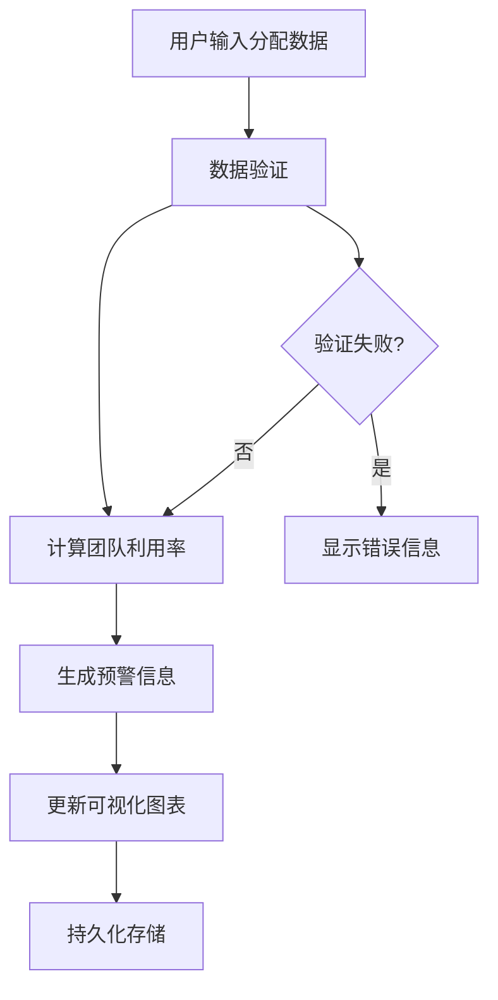
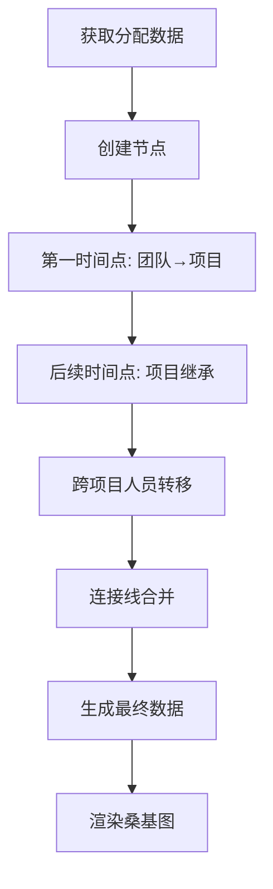

# Omada 研发人力排布可视化工具 - 架构设计文档

## 📋 项目概述

**Omada 研发人力排布可视化工具** 是一个基于React + TypeScript + Vite构建的企业级人力资源管理平台，专为研发团队的复杂人力调配场景设计。支持8个团队、78人在11个项目中4个时间节点的智能分配和可视化分析。

## 🏗️ 系统架构

### 整体架构图

```
┌─────────────────────────────────────────────────────────────┐
│                     前端应用层 (React App)                    │
├─────────────────────────────────────────────────────────────┤
│  ┌─────────────┐  ┌─────────────┐  ┌─────────────┐  ┌──────┐ │
│  │基础配置模块  │  │人力排布模块  │  │可视化模块   │  │导出  │ │
│  │ConfigModule │  │AllocationMod│  │Visualization│  │Export│ │
│  └─────────────┘  └─────────────┘  └─────────────┘  └──────┘ │
├─────────────────────────────────────────────────────────────┤
│                     组件层 (Components)                      │
├─────────────────────────────────────────────────────────────┤
│  ┌─────────────┐  ┌─────────────┐  ┌─────────────┐  ┌──────┐ │
│  │UI基础组件   │  │业务组件     │  │图表组件     │  │工具  │ │
│  │Button,Switch│  │AllocationGrid│  │SankeyChart  │  │Utils │ │
│  │Modal,Input  │  │ProjectConfig │  │Distribution │  │      │ │
│  └─────────────┘  └─────────────┘  └─────────────┘  └──────┘ │
├─────────────────────────────────────────────────────────────┤
│                   状态管理层 (Zustand)                       │
├─────────────────────────────────────────────────────────────┤
│  ┌─────────────┐                    ┌─────────────┐          │
│  │configStore  │                    │dataStore    │          │
│  │- teams      │                    │- allocations│          │
│  │- projects   │                    │- validation │          │
│  │- timePoints │                    │- statistics │          │
│  └─────────────┘                    └─────────────┘          │
├─────────────────────────────────────────────────────────────┤
│                   数据持久化层 (Storage)                      │
├─────────────────────────────────────────────────────────────┤
│  ┌─────────────┐  ┌─────────────┐  ┌─────────────┐          │
│  │localStorage │  │SessionStorage│  │Export Files │          │
│  │配置数据     │  │临时数据     │  │HTML/Excel   │          │
│  └─────────────┘  └─────────────┘  └─────────────┘          │
└─────────────────────────────────────────────────────────────┘
```

### 技术栈架构

```
┌─────────────────────────────────────────────────────────────┐
│                      开发工具链                              │
│  Vite + TypeScript + ESLint + Tailwind CSS                 │
├─────────────────────────────────────────────────────────────┤
│                      前端框架                                │
│  React 18 + React Hooks + Function Components              │
├─────────────────────────────────────────────────────────────┤
│                      状态管理                                │
│  Zustand (轻量级状态管理) + localStorage持久化              │
├─────────────────────────────────────────────────────────────┤
│                      UI & 样式                               │
│  Tailwind CSS + 自定义组件系统 + 响应式设计                 │
├─────────────────────────────────────────────────────────────┤
│                      数据可视化                              │
│  ECharts 5.4.3 + 自定义图表组件 + 交互式Dashboard          │
├─────────────────────────────────────────────────────────────┤
│                      数据处理                                │
│  TypeScript类型系统 + Lodash工具库 + 数据验证               │
└─────────────────────────────────────────────────────────────┘
```

## 🔧 核心模块设计

### 1. 配置管理模块 (Config Module)

**职责**: 管理团队、项目、时间点的基础配置

**组件结构**:
```typescript
src/modules/config/
├── TeamConfig.tsx      # 团队配置组件
├── ProjectConfig.tsx   # 项目配置组件
└── TimeConfig.tsx      # 时间点配置组件
```

**数据模型**:
```typescript
interface Team {
  id: string;
  name: string;
  capacity: number;
  description: string;
  color: string;
}

interface Project {
  id: string;
  name: string;
  status: ProjectStatus;
  description: string;
  color: string;
}

interface TimePoint {
  id: string;
  name: string;
  date: string;
  type: TimePointType;
  description: string;
}
```

### 2. 人力排布模块 (Allocation Module)

**职责**: 提供人力分配的交互界面和数据管理

**核心组件**: `AllocationGrid.tsx`

**关键特性**:
- 冻结表头和第一列
- 实时数据校验和颜色预警
- 显示控制开关
- 数字格式化优化
- 响应式布局

**数据结构**:
```typescript
interface Allocation {
  occupied: number;
}

interface AllocationMatrix {
  [timePointId: string]: {
    [projectId: string]: {
      [teamId: string]: Allocation;
    };
  };
}
```

### 3. 可视化模块 (Visualization Module)

**职责**: 提供桑基图和分布图的可视化分析

**组件结构**:
```typescript
src/modules/visualization/
├── SankeyChart.tsx       # 桑基图组件
└── DistributionChart.tsx # 分布图组件
```

#### 3.1 桑基图设计

**算法核心**:
```typescript
// 智能人力流动算法
1. 资源收集阶段: 收集上一时间点所有项目的人力资源，按团队分组
2. 需求分析阶段: 分析当前时间点每个项目的人力需求，按团队分组
3. 智能分配阶段:
   - 同一项目优先继承（取最小值）
   - 剩余需求从其他项目的同团队资源中分配
   - 严格团队类型匹配，避免跨领域分配
4. 连接线合并: 相同source和target的连接线自动合并，保留团队详情
```

**数据结构**:
```typescript
interface SankeyNode {
  name: string;
  value?: number;
  itemStyle?: { color: string };
  category?: number;
}

interface SankeyLink {
  source: string;
  target: string;
  value: number;
  teamDetails?: {[teamId: string]: {name: string, value: number, color: string}};
}
```

#### 3.2 分布图设计

**功能特性**:
- 左侧饼图显示时间点分布
- 右侧折线图显示趋势变化
- 时间轴交互联动
- 按项目维度统计

## 🎨 UI组件系统

### 组件分层架构

```
┌─────────────────────────────────────────────────────────────┐
│                      业务组件层                              │
│  AllocationGrid, SankeyChart, DistributionChart            │
├─────────────────────────────────────────────────────────────┤
│                      复合组件层                              │
│  TopBar, Menu, Tabs, Breadcrumb                            │
├─────────────────────────────────────────────────────────────┤
│                      基础组件层                              │
│  Button, Switch, Modal, Input                              │
└─────────────────────────────────────────────────────────────┘
```

### 设计系统规范

**颜色系统**:
```typescript
// 团队颜色 (8种)
const teamColors = [
  '#3B82F6', '#EF4444', '#10B981', '#F59E0B',
  '#8B5CF6', '#06B6D4', '#EC4899', '#84CC16'
];

// 项目颜色 (11种)
const projectColors = [
  '#1E40AF', '#DC2626', '#059669', '#D97706',
  '#7C3AED', '#0891B2', '#BE185D', '#65A30D',
  '#4338CA', '#B91C1C', '#047857'
];

// 状态颜色
const statusColors = {
  normal: '#10B981',    // 绿色 - 正常
  warning: '#F59E0B',   // 黄色 - 满配
  danger: '#EF4444'     // 红色 - 超配
};
```

**间距系统**:
```css
/* 基于Tailwind CSS的8px基准间距系统 */
.spacing-xs { padding: 0.25rem; }  /* 4px */
.spacing-sm { padding: 0.5rem; }   /* 8px */
.spacing-md { padding: 1rem; }     /* 16px */
.spacing-lg { padding: 1.5rem; }   /* 24px */
.spacing-xl { padding: 2rem; }     /* 32px */
```

## 📊 状态管理架构

### Zustand Store设计

```typescript
// 配置Store
interface ConfigStore {
  teams: Team[];
  projects: Project[];
  timePoints: TimePoint[];
  
  // Actions
  addTeam: (team: Team) => void;
  updateTeam: (id: string, updates: Partial<Team>) => void;
  deleteTeam: (id: string) => void;
  // ... 其他actions
}

// 数据Store
interface DataStore {
  allocations: AllocationMatrix;
  validation: ValidationResult;
  statistics: Statistics;
  
  // Actions
  updateAllocation: (timePointId: string, projectId: string, teamId: string, allocation: Allocation) => void;
  validateData: () => void;
  calculateStatistics: () => void;
}
```

### 数据流设计

```
┌─────────────┐    ┌─────────────┐    ┌─────────────┐
│  用户操作   │───▶│  Store更新  │───▶│  组件重渲染  │
└─────────────┘    └─────────────┘    └─────────────┘
       ▲                   │                   │
       │                   ▼                   │
┌─────────────┐    ┌─────────────┐    ┌─────────────┐
│  UI反馈     │◀───│  持久化存储  │◀───│  副作用处理  │
└─────────────┘    └─────────────┘    └─────────────┘
```

## 🔄 数据处理流程

### 人力分配计算流程



### 桑基图数据生成流程



## 🚀 性能优化策略

### 1. 组件优化

**React优化**:
```typescript
// 使用React.memo避免不必要的重渲染
const AllocationGrid = React.memo(({ teams, projects, timePoints }) => {
  // 组件实现
});

// 使用useMemo缓存计算结果
const sankeyData = useMemo(() => {
  return generateSankeyData(teams, projects, timePoints, allocations);
}, [teams, projects, timePoints, allocations]);

// 使用useCallback缓存回调函数
const handleAllocationChange = useCallback((timePointId, projectId, teamId, value) => {
  updateAllocation(timePointId, projectId, teamId, { occupied: value });
}, [updateAllocation]);
```

### 2. 数据优化

**状态管理优化**:
```typescript
// 使用immer进行不可变更新
import { produce } from 'immer';

const updateAllocation = (timePointId, projectId, teamId, allocation) => {
  set(produce((state) => {
    state.allocations[timePointId][projectId][teamId] = allocation;
  }));
};
```

**本地存储优化**:
```typescript
// 防抖保存，避免频繁写入
const debouncedSave = debounce((data) => {
  localStorage.setItem('allocation-data', JSON.stringify(data));
}, 500);
```

### 3. 渲染优化

**图表优化**:
```typescript
// ECharts图表懒加载和按需更新
const chart = useRef(null);

useEffect(() => {
  if (chart.current && data) {
    chart.current.setOption(option, { notMerge: false, lazyUpdate: true });
  }
}, [data, option]);
```

## 🔒 数据安全设计

### 1. 类型安全

**TypeScript严格模式**:
```typescript
// tsconfig.json
{
  "compilerOptions": {
    "strict": true,
    "noImplicitAny": true,
    "strictNullChecks": true,
    "strictFunctionTypes": true
  }
}
```

### 2. 数据验证

**运行时验证**:
```typescript
const validateAllocation = (allocation: Allocation): ValidationResult => {
  const errors: string[] = [];
  
  if (allocation.occupied < 0) {
    errors.push('人力分配不能为负数');
  }
  
  if (allocation.occupied > 100) {
    errors.push('单个分配不能超过100人');
  }
  
  return { isValid: errors.length === 0, errors };
};
```

### 3. 错误处理

**边界错误处理**:
```typescript
class ErrorBoundary extends React.Component {
  constructor(props) {
    super(props);
    this.state = { hasError: false };
  }
  
  static getDerivedStateFromError(error) {
    return { hasError: true };
  }
  
  componentDidCatch(error, errorInfo) {
    console.error('应用错误:', error, errorInfo);
  }
  
  render() {
    if (this.state.hasError) {
      return <ErrorFallback />;
    }
    
    return this.props.children;
  }
}
```

## 📱 响应式设计

### 断点系统

```css
/* Tailwind CSS断点 */
sm: 640px   /* 小屏幕 */
md: 768px   /* 中等屏幕 */
lg: 1024px  /* 大屏幕 */
xl: 1280px  /* 超大屏幕 */
2xl: 1536px /* 超超大屏幕 */
```

### 适配策略

**表格适配**:
```typescript
// 小屏幕下简化显示
const isMobile = useMediaQuery('(max-width: 768px)');

return (
  <div className={`
    ${isMobile ? 'overflow-x-auto' : 'overflow-auto'}
    ${isMobile ? 'text-xs' : 'text-sm'}
  `}>
    {/* 表格内容 */}
  </div>
);
```

**图表适配**:
```typescript
// 图表响应式配置
const chartOption = {
  grid: {
    left: isMobile ? '5%' : '10%',
    right: isMobile ? '5%' : '10%',
    top: isMobile ? '15%' : '12%',
    bottom: isMobile ? '15%' : '8%'
  }
};
```

## 🔄 部署架构

### 构建流程


### 部署配置

```typescript
// vite.config.ts
export default defineConfig({
  build: {
    target: 'es2015',
    outDir: 'dist',
    assetsDir: 'assets',
    sourcemap: false,
    minify: 'terser',
    rollupOptions: {
      output: {
        manualChunks: {
          vendor: ['react', 'react-dom'],
          charts: ['echarts'],
          utils: ['lodash']
        }
      }
    }
  }
});
```

## 📈 监控与分析

### 性能监控

```typescript
// 性能指标收集
const performanceObserver = new PerformanceObserver((list) => {
  for (const entry of list.getEntries()) {
    if (entry.entryType === 'measure') {
      console.log(`${entry.name}: ${entry.duration}ms`);
    }
  }
});

performanceObserver.observe({ entryTypes: ['measure'] });
```

### 用户行为分析

```typescript
// 用户操作追踪
const trackUserAction = (action: string, data?: any) => {
  // 发送到分析服务
  analytics.track(action, {
    timestamp: new Date().toISOString(),
    data
  });
};
```

## 🔮 扩展性设计

### 插件化架构

```typescript
// 插件接口定义
interface Plugin {
  name: string;
  version: string;
  install: (app: Application) => void;
  uninstall?: (app: Application) => void;
}

// 插件管理器
class PluginManager {
  private plugins: Map<string, Plugin> = new Map();
  
  register(plugin: Plugin) {
    this.plugins.set(plugin.name, plugin);
    plugin.install(this.app);
  }
  
  unregister(name: string) {
    const plugin = this.plugins.get(name);
    if (plugin?.uninstall) {
      plugin.uninstall(this.app);
    }
    this.plugins.delete(name);
  }
}
```

### 主题系统

```typescript
// 主题配置
interface Theme {
  colors: {
    primary: string;
    secondary: string;
    background: string;
    text: string;
  };
  spacing: {
    xs: string;
    sm: string;
    md: string;
    lg: string;
    xl: string;
  };
  typography: {
    fontFamily: string;
    fontSize: {
      xs: string;
      sm: string;
      base: string;
      lg: string;
      xl: string;
    };
  };
}
```

## 📚 总结

Omada 研发人力排布可视化工具采用现代化的前端架构设计，具备以下特点：

### 🏆 架构优势

1. **模块化设计**: 清晰的模块分离，易于维护和扩展
2. **类型安全**: 完整的TypeScript类型系统，减少运行时错误
3. **性能优化**: 多层次的性能优化策略，确保流畅体验
4. **响应式设计**: 适配多种设备和屏幕尺寸
5. **可扩展性**: 插件化架构，支持功能扩展

### 🎯 技术亮点

1. **智能算法**: 复杂的人力流动算法，支持项目继承和团队匹配
2. **数据可视化**: 专业的ECharts图表，支持交互和联动
3. **状态管理**: 轻量级Zustand状态管理，支持持久化
4. **组件系统**: 完整的UI组件库，统一的设计规范
5. **工程化**: 现代化的开发工具链，支持类型检查和代码规范

### 🚀 未来发展

1. **微前端**: 支持微前端架构，独立部署和升级
2. **实时协作**: 支持多用户实时协作编辑
3. **AI辅助**: 集成AI算法，智能推荐人力分配方案
4. **移动端**: 开发移动端应用，支持移动办公
5. **云端同步**: 支持云端数据同步和备份

---

**文档版本**: v1.0  
**最后更新**: 2025年7月  
**维护者**: Lucien Chen